# CYBR MATERIAL

A reproducible procedural PBR pipeline for dense natural surfaces and worn
finishes: ten materials, native 4K maps, editable Blender scenes and genuine
Cycles renders, including three full architectural interiors with hardwood
flooring and stone joinery. Every material is generated from parameters and physical
structure models. No source images or image-generated textures are inputs.

**The old materials needed a structural rebuild.** V3 replaces obvious cell
patterns, repeated crater shapes, painted corrosion and exaggerated wood relief.
The [critical review](docs/CRITICAL_REVIEW.md) explains the failures, the changes
and the remaining limitations without calling procedural textures scans.

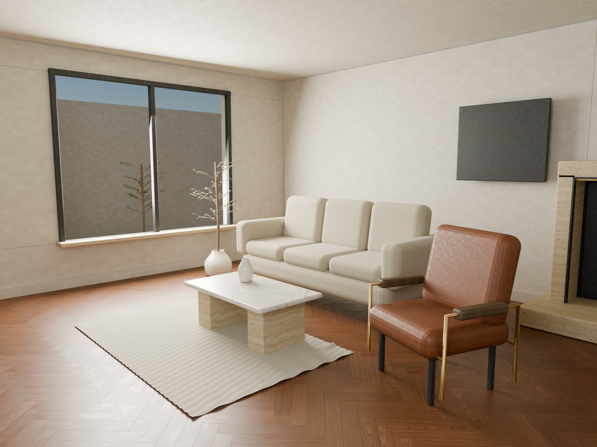

## Get the complete suite

[Download the latest complete release](https://github.com/cybrdelic/cybr-material/releases/latest)
for all textures, Unity exports, native 16-bit renders, portable `.blend` files,
offline galleries, source and checksums. The same unpacked assets are published
in this repository by the build workflow.

Open `OPEN_ME.html` after extracting the archive. Open
`path_traced/OPEN_RENDERS.html` to inspect the scene renders and close-ups.
Keep the `materials/` and `blender/` folders beside one another: texture paths
in the Blender files are relative.

## Architectural interiors and hardwood flooring

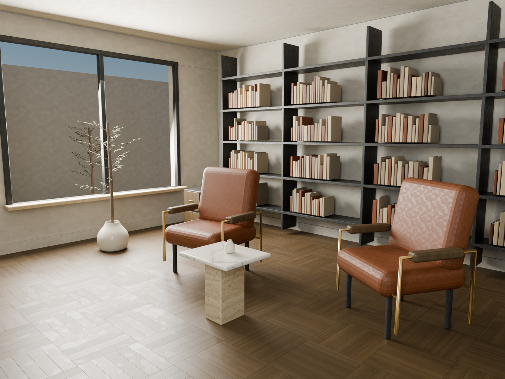
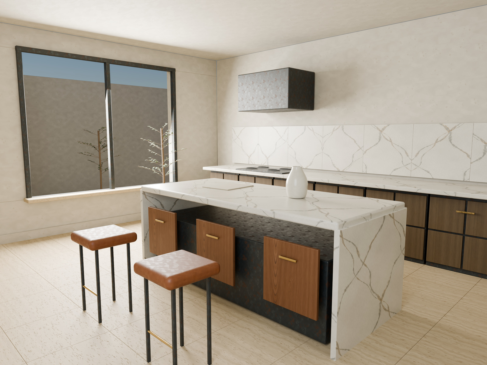
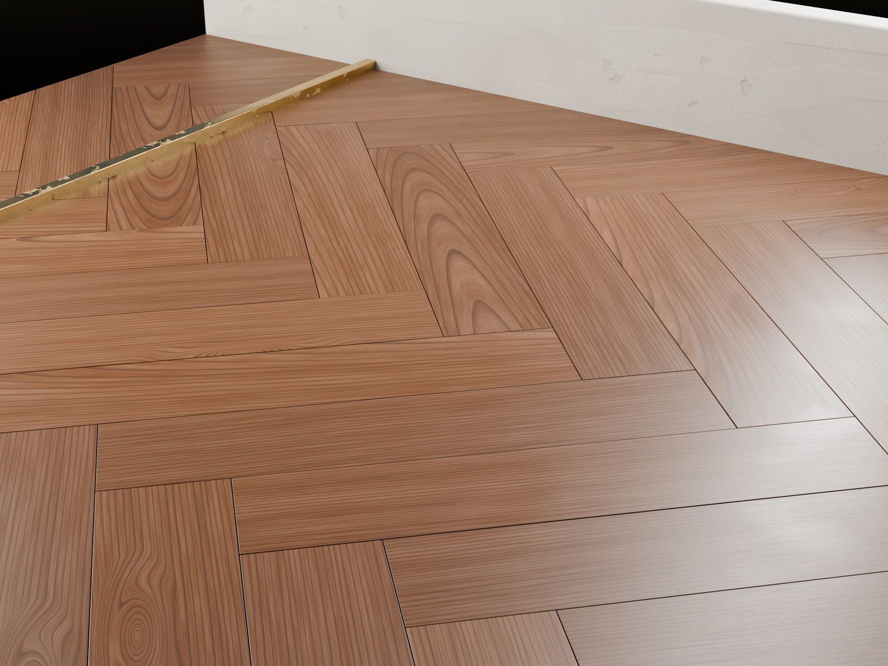

V3.1 adds a **7 × 6 m walnut salon**, **6.4 × 5.5 m oak reading room**,
**6.8 × 5.8 m stone kitchen**, and a dedicated floor detail. All four are
rendered at a native **2048 × 1536**. Furniture, windows, courtyard, flooring,
books and joinery are actual editable meshes; there are no picture backdrops.

The hardwood floors contain individually clipped, 16 mm thick boards, 0.8 mm
joints and 0.45 mm eased edges. Walnut uses approximately 542 × 108 mm
herringbone cuts; oak uses 443 × 89 mm basket cuts. Their UVs preserve the
finite wood atlas' physical scale. Board finish varies deterministically;
circulation zones change roughness through world-position contact polish.

The three rooms use **512 maximum / 128 minimum Cycles samples** and
OpenImageDenoise with albedo and normal guides. The floor detail uses **768 / 128
samples without denoising**, so its fine surface structure can be inspected
directly. Render settings and timings are recorded per frame.

## Material studies

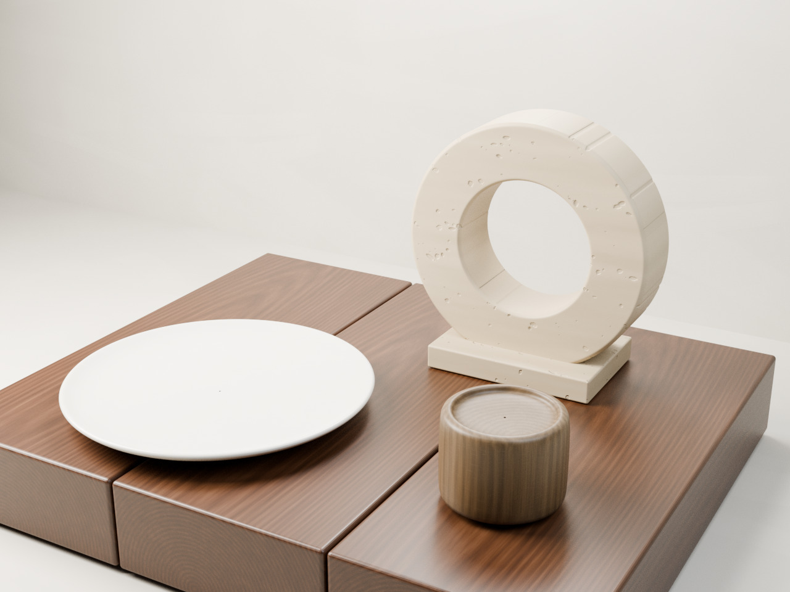
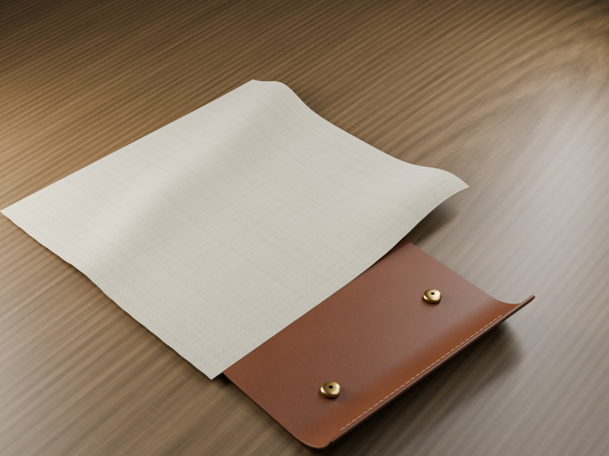
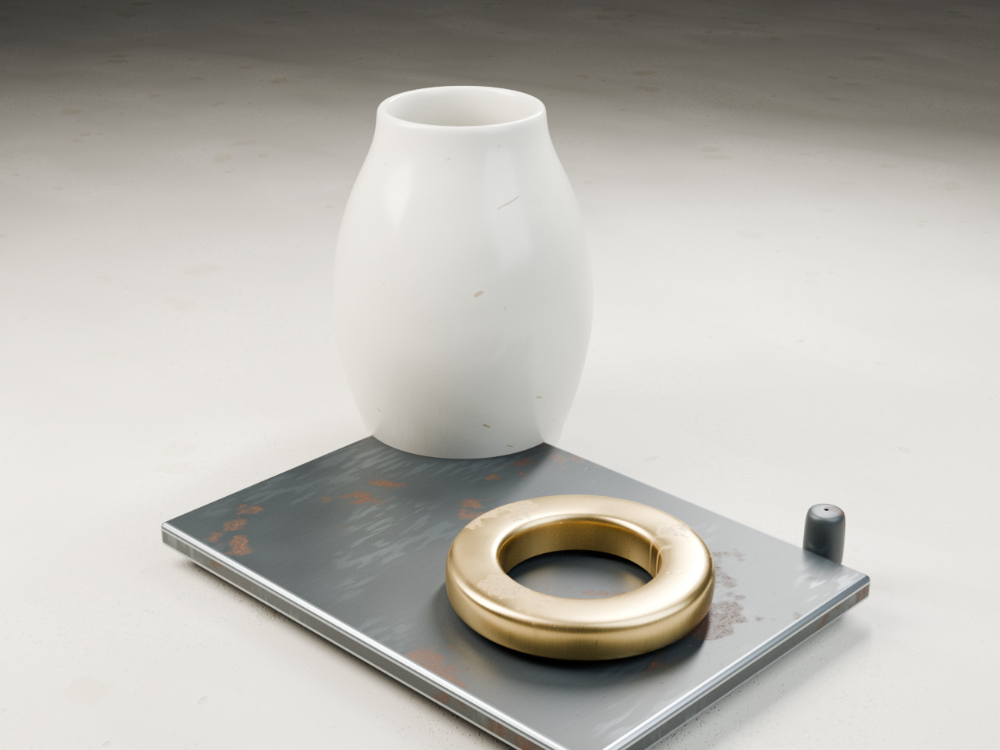

These are renders of real 3D meshes and material nodes in **Blender Cycles**.
The saved scenes include lights, cameras and physical displacement. Native
renders are 16-bit RGB PNGs; the README uses JPEG display copies. The original
ten close-ups and three still lifes remain raw at 768 / 128 samples. There is
no sharpening, artificial grain or image upscaling in any final render.

## Materials and physical scale

| Material | Tile width | Main surface structures |
|---|---:|---|
| Calacatta Oro | 800 mm | Fractured mineral seams, ochre fronts, intergrowth and abrasion |
| Roman Travertine | 650 mm | Porous sediment beds, torn cavities and mineral laminae |
| American Walnut | 550 mm | Radial growth volume, diffuse lumen windows, fine rays and worn finish |
| Fumed Oak | 450 mm | Radial growth volume, earlywood vessels, medullary plates and worn finish |
| Champagne Brass | 200 mm | Tooling, grouped scores, tarnish fronts and verdigris |
| Blackened Steel | 250 mm | Rubbed exposure, granular rust crusts and corrosion pits |
| Bone Porcelain | 240 mm | Arrested craze cracks, glaze ripples, pinholes and chips |
| Saddle Leather | 180 mm | Stretched creases, follicles, compression and burnished finish |
| Lime Plaster | 650 mm | Overlapping trowel applications, aggregate and delamination |
| Natural Linen | 85 mm | Fine flax weave, fibrils, slubs and transparent yarn openings |

One UV tile must cover the listed distance. Arbitrary UV scale changes both
feature size and the normal slope implied by the height field. Physical values
are artistic estimates, not laboratory measurements.

## Maps

Each material has twelve native 4096 × 4096 PNG maps, plus a swatch and
`material.json`. The two woods are finite procedural board cuts, not certified
seamless tiles. Their default extents are 550 mm for walnut and 450 mm for oak.
The workflow is metallic/roughness.

| File | Interpretation |
|---|---|
| `BaseColor.png` | RGB8, sRGB; intrinsic color without lights or cast shadows |
| `Roughness.png` | Gray8, linear / Non-Color |
| `Metallic.png` | Gray8, linear; exposed metal versus dielectric oxide coverage |
| `Normal_OpenGL.png` | RGB8, tangent space, +Y |
| `Normal_DirectX.png` | RGB8, tangent space, -Y; inverted green channel |
| `Height.png` | Gray16, linear; full surface relief |
| `Height_Macro.png` | Gray16, linear; geometry band of the same height field |
| `Normal_Micro_OpenGL.png` | RGB8, +Y; residual relief for use with macro displacement |
| `AO.png` | Gray8, linear; local cavity approximation |
| `ORM.png` | RGB8, linear; R = AO, G = roughness, B = metallic |
| `WearMask.png` | Gray8, linear; material-specific weathering or abrasion |
| `Opacity.png` | Gray8, linear; linen yarn coverage, fully opaque for other materials |

Displacement in meters is `(height - 0.5) × height_scale_m`.
Use the material's `height_scale_m` in `material.json`. For true displacement,
pair **Height_Macro** with **Normal_Micro_OpenGL**. For a surface without geometric
displacement, use **Normal_OpenGL**. Combining macro displacement with the full
normal would add the same relief twice. The wood shader instead derives the
normal from its physical height band so fitted cuts have the correct slopes.

AO is supplied for engines that require it. The Blender material does not
multiply AO into base color. Opacity is connected to the shader for woven holes.
HDRP and URP exports are supplied in `exports/`; channel layouts are documented
in the [import guide](docs/IMPORT_GUIDE.md).

## Inspect the changes

| Previous surface | Revised surface |
|---|---|
| 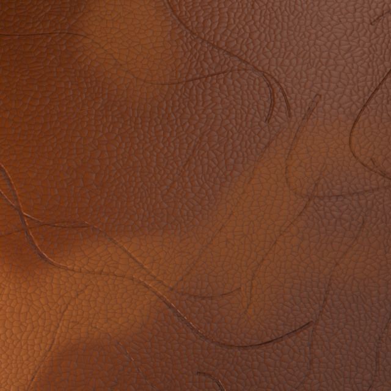 | 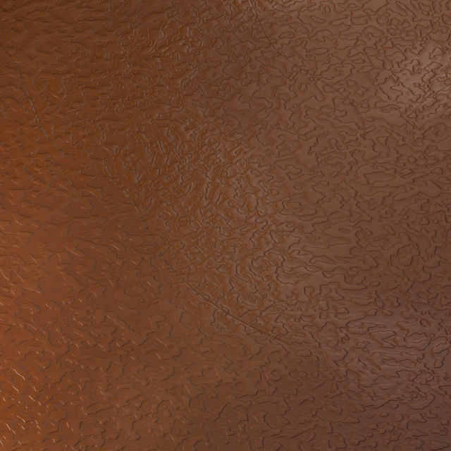 |
| 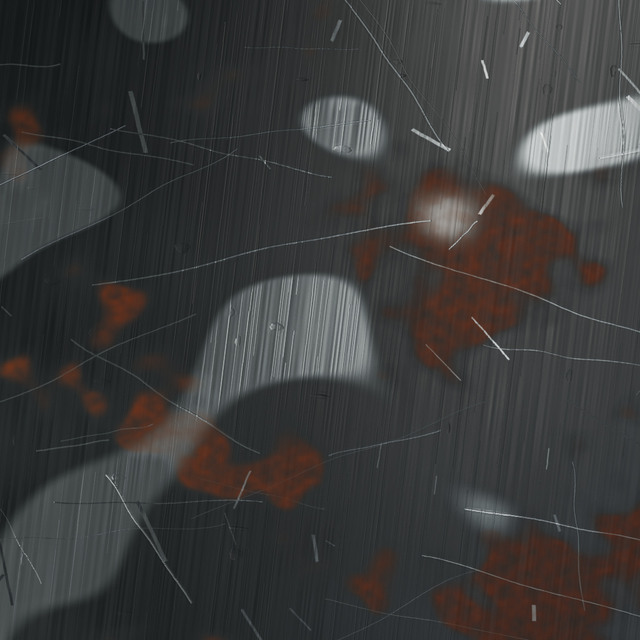 | 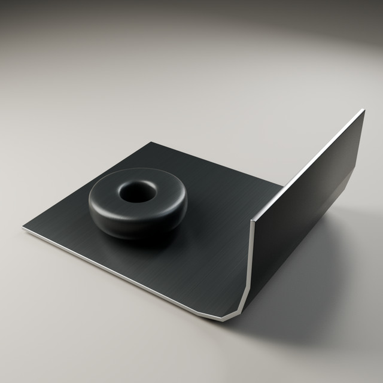 |
| 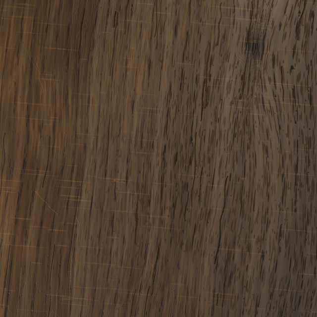 | 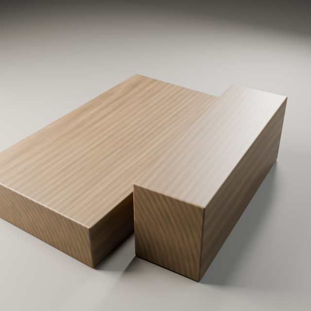 |

The inspection width and lighting are matched. All ten before-and-after pairs
are retained in `docs/images/` and shown in the offline gallery.

## Files

```text
materials/                  120 maps at native resolution and physical metadata
exports/                    Unity HDRP and URP channel packing
blender/                    Material assets and editable Cycles scenes
path_traced/renders/         10 close-ups, 3 still lifes, 3 interiors, 1 floor detail
path_traced/                 Offline render gallery, metadata and verification
docs/                       Import guide, critical review and comparison images
source/                     Deterministic generators, scenes and validators
source/legacy_v2/            Original generator retained for comparison
SHA256SUMS.txt               Checksums of the packaged deliverables
```

## Pipeline

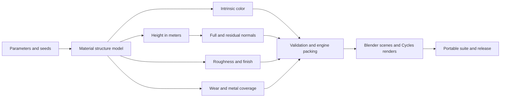

Wood profiles in [`source/wood_profiles.json`](source/wood_profiles.json) control
cut depth, pith offset, annual ring widths, vessel radius and length, ray sizes,
finish, color and seeds. Changing them regenerates the maps together. The
[pipeline guide](docs/PIPELINE.md) explains the structure models and their limits.
[`source/architectural_scenes.py`](source/architectural_scenes.py) constructs
the rooms, parquet layouts, fitted cuts, furniture and daylight openings.

## Rebuild

Use Python 3.12 and the **official Blender 4.3.2 build** with OpenImageDenoise.
Some distribution builds omit that denoiser. Map generation needs NumPy, SciPy and Pillow;
the Blender scene scripts use Blender's own Python. CPU rendering can take
several hours. Adaptive sampling uses a minimum of 128 samples, with 768 maximum
for the raw studies and 512 for the guided interiors. Actual settings and timings are recorded in
`path_traced/render_manifest.json`.

```bash
python -m pip install -r source/requirements.txt
python source/build_suite.py
```

To rebuild just the maps or render one material:

```bash
python source/generate_materials.py --resolution 4096
blender -b --python source/render_path_traced.py -- \
  --kind macros --only 08_saddle_leather --size 1024 \
  --samples 768 --min-samples 128 --threshold .005
blender -b --python source/render_path_traced.py -- \
  --kind architecture --only 14_walnut_salon --size 2048 \
  --samples 512 --min-samples 128 --threshold .01 --denoise
```

The [build workflow](.github/workflows/build-suite.yml) generates and validates
one shared map set, distributes the seventeen Cycles frames across CPU jobs,
assembles portable scenes, commits the generated assets, and publishes a
versioned ZIP release. Checks cover map dimensions and bit depth, exact packed channels,
normal conventions, woven opacity, relative texture paths and actual Cycles
settings, physical parquet coverage and native render dimensions. Visual realism
still requires judgment; these checks cannot certify it.

For a geometry-only correction after a complete build, the
[architectural repair workflow](.github/workflows/render-scene.yml) renders selected
architectural view, rebuilds the portable scene file, validates all seventeen
outputs and packages the complete suite. Its manual input selects the view;
a source commit marked `[scene repair]` selects all four architectural views and
skips the full render matrix. Use this only when material maps and the other
views are unchanged. Saved-mesh checks also verify book-to-shelf contacts.

## Provenance and limits

All ten materials are original deterministic procedural work. No source
photographs, scans or image-generated textures are used. Color, roughness,
height and wear share material-specific structure models; height is not inferred
from painted color. All scene previews are actual Cycles renders.

The suite remains an approximation. Growth and wear models are physically
inspired, not measured material data. Wood end grain, free-standing fibers,
undercut porosity, measured reflectance and mesh-specific wear need further
work for demanding close-ups.

No redistribution license has been selected for this repository.
