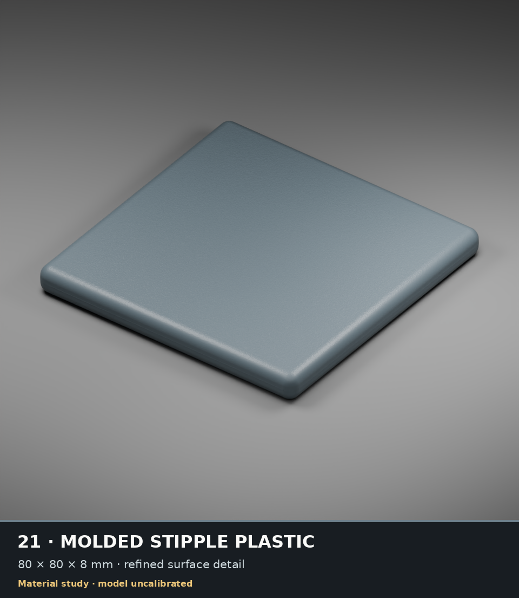

# CYBR MATERIAL engineering checkpoint · 2026-10-06

This additive checkpoint preserves the current 35-material selection, unified
build/capture interface, renderer corrections, selected appearance provenance,
process research, tests and exact recovery references. Original repository assets
remain intact. Experimental code is retained without being selected automatically.

## Start here

- [Current status and limitations](STATUS.md)
- [Principal-engineer plan](PRINCIPAL_ENGINEER_PLAN.md)
- [Current source and capture registry](../material-workspace/shared/material-production/registry.json)
- [Unified command interface](../material-workspace/shared/material-production/README.md)
- [Capture modes](../material-workspace/shared/material-production/CAPTURE_MODES.md)
- [Large-artifact recovery inventory](ARTIFACTS.json)
- [Protected organic baseline and research status](ORGANIC_STATUS.md)

## Repository layout

`material-workspace/shared/material-production` contains the unified command
interface, selected registry, pinned original/aggregate source adapters and tests.
`material-workspace/shared/cloud-eevee` contains the actual shared Cycles/EXR/OIDN
capture implementation and its numerical/cache contracts. `research` preserves
current source and bounded receipts for technical, organic and textile studies;
it is not a second production selection.

Large `.blend`, native map, simulation-state and raw-pass binaries are preserved
in the exact Library archives in `ARTIFACTS.json`, rather than duplicated in Git.
IDs are owner recovery references, not public download URLs. Selected complete
image identities and hashes remain in the registry and renderer handoff. The
plastic preview below is copied byte-for-byte from the reviewed native render.



## Checks from a clean source checkout

```sh
python -m pip install numpy scipy Pillow
python audit/verify_checkpoint.py
OPENBLAS_NUM_THREADS=1 OMP_NUM_THREADS=1 python audit/run_portable_tests.py
```

These checks need no scenes, maps, Blender, network accounts or credentials.
They test source integrity, syntax, catalog selection and portable numerical/path
contracts. They do not run every historical experiment or certify realism.

## Reconstructing complete scenes

Restore the artifact version and hash required by the selected registry first.
Preserve the `material-workspace/shared` tree, set `MATERIAL_WORKSPACE` to the
absolute `material-workspace` directory, and use an explicit
`MATERIAL_PATH_MAP_FILE` when original embedded paths need relocation. Never
rewrite frozen source hashes or silently substitute missing assets.

Run `python -m materials doctor` from `material-workspace/shared/material-production`
to distinguish available assets from qualification. Captures additionally need
the recorded Blender 4.3.2 and OIDN 2.5.1 tools. Individual research scripts still
have historical absolute paths and larger binary inputs. Full clean-clone scene
reconstruction and all-material physical/visual qualification remain incomplete.
