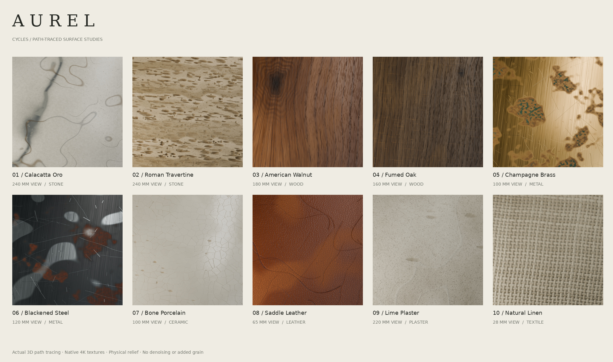

# Critical review: where the old suite failed

The previous suite did **not** meet a premium photoreal material standard. Its
technical packaging was stronger than its surface anatomy. More scratches and
more samples made it busier, but the dominant patterns still gave the procedure
away. Path tracing made those problems easier to see; it could not fix them.

The central mistake was treating detail density as realism. Natural detail needs
a cause, a scale, a distribution, and a relationship to the finish around it.
Repeated ellipses, equally sharp lines, smooth threshold blobs and recognizable
cell diagrams are poor substitutes.

## Material-by-material criticism and revision

| Material | What failed in V2 | What the V3 generator changes | What still needs scrutiny |
|---|---|---|---|
| Calacatta Oro | Looping seams looked drawn on. Vein edges were blurry and the matrix lacked a credible hierarchy of mineral structures. | Winding mineral seams have irregular widths, fractured margins, adjacent breccia fragments, ochre fronts, intergrowth and shallow calcite detail. | Seam trajectories remain authored abstractions. Crystal optics and translucency are not measured. |
| Roman Travertine | Too many similar horizontal pits, spaced too uniformly. Dark cavity color helped fake depth. | Torn cavities have a broad size range, varied floors and clustered distributions along porous beds. Intrinsic mineral residue is separated from geometric cavity shadow. | A height field cannot reproduce undercuts or fully connected internal porosity. |
| American Walnut | Long needle cuts were too deep. The knot looked like a dark vignette, and the oily highlight made the wood seem waxy. | A board samples a radial growth volume with variable annual ring widths and an oblique branch intersection. Radially sampled fibers, tapered lumen windows and shallow finish wear drive the maps together. | Annual shells remain too orderly for strongly figured timber. This remains face-grain wood; cut ends need their own model. |
| Fumed Oak | Vessel marks were excessive and too uniform. Grain anatomy did not sufficiently differ from walnut. | The rift-cut growth volume concentrates large vessels in earlywood and uses finite medullary ray plates. Depth follows lumen size and finish, independently of pigment. | Ray shape and annual growth variability still simplify real oak anatomy. |
| Champagne Brass | Corrosion resembled painted camouflage. Long bright lines looked like drawn scratches. Brushing was too strong. | Particle-built oxidation fronts, shallow crust relief, sparse verdigris, micrometer tooling and local abrasion bundles. Oxide coverage changes metalness and roughness. | A generic tile cannot know where a particular object was handled or exposed to water. |
| Blackened Steel | Soft rust islands and isolated silver ovals looked pasted on. Score lines crossed without a convincing contact pattern. | Directional rubbed exposure, clustered abrasive scores, terraced granular rust and correlated corrosion pits. The scene plate also has a rubbed machined bevel. | Rust chemistry and exact reflectance are artistic approximations; wear must be adapted to each mesh. |
| Bone Porcelain | The crack network clearly revealed a Voronoi diagram. Similar cell sizes and thick borders were synthetic. | Curved cracks grow and stop at earlier cracks, forming T contacts. Glaze ripples, pinholes and torn body chips use separate physical scales. | The stress simulation is simplified. Thickness-dependent translucency and real glaze layering are absent. |
| Saddle Leather | The grain read as tessellated cobblestone or reptile scales. Random curved scores distracted from the hide. | Soft stretched crease contours replace polygon boundaries. Shallow follicles, broad compression, burnished regions and grouped scuffs distinguish causes of wear. | Hide orientation and follicle groupings remain approximate. Cut edges need their own fibrous material. |
| Lime Plaster | Uniform small pits and wormlike cracks made the wall look sprayed with a procedural pattern. | Overlapping tapered trowel passes have directional lips and polished interiors. Exposed angular aggregate, delamination and pinholes follow application conditions. | Some application patterns still repeat with the tile. Real exposed aggregate has more varied mineral optics. |
| Natural Linen | Puffy yarns suggested a coarse basket weave. The fabric was a solid surface with a woven emboss. | A finer 120-yarn plain weave, continuous over-under bends, smaller slubs, fibrils and actual inter-yarn opacity openings. | Map-based fibers do not reproduce free-standing flyaways. Woven holes in a height-mapped sheet approximate full yarn geometry. |

## A regression caught during the rebuild

The first V3 wood rewrite was worse: a shared sinusoidal drift made the growth
bands wobble together, and its reduced albedo variation flattened the wood. The
user called it out. A subsequent image-generated color detour was also rejected
because the goal is a reproducible material pipeline, not a processor of generated
pictures. Neither approach supplies the final woods.

The replacement samples a finite board through a radial growth volume. Nonuniform
annual rings determine both pigment density and vessel placement. Projected lumen
windows and ray plates determine physical relief and finish response. Every map
is generated from the model; no color image is a source for another map.

The first anatomy draft still failed visually: too many dark, short vessel
windows looked like sprinkled dashes, while the broad grain was weak. The
revision reduces pore contrast and depth, lengthens and tapers intersections,
groups their placement with cell bundles and samples fine fibers in radial
coordinates. Walnut's optional branch cylinder turns those coordinates into
a knot intersection without painting a dark vignette.

Full-size review also exposed a repeated three-lobed cavity outline across
several materials. The shared deposit helper now uses variable irregular
polygonal perimeters and steeper torn rims. Plaster gains finer matrix relief
and more visible aggregate; porcelain craze contrast is increased without
widening every crack.

## The technical problems behind the visual problems

- **Exaggerated relief:** the old walnut and oak maps spanned about 0.700 mm
  and 0.966 mm. That made everyday grain look gouged. V3 lowers the physical
  ranges while keeping pore and finish detail. Final encoded measurements are
  recorded in [material validation](../materials/validation.json).
- **Repeated wear primitives:** changing a seed does not change the underlying
  ellipse, spline or cell grammar. V3 varies morphology and distribution by
  material, rather than applying one generic distress pattern everywhere.
- **Color doing the lighting's job:** cavity darkness can become baked shading.
  The travertine revision reduces this. Geometric relief supplies the shadow;
  base color describes mineral differences and residues.
- **Surface-insensitive wear:** a repeating texture cannot infer a mesh's edges,
  handling zones or contact surfaces. The steel plate's bevel receives explicit
  exposed-metal treatment; the other tiles still require contextual art direction.
- **Repeated boards:** all three walnut boards previously sampled the same cut.
  The revised scene offsets their UV origins.
- **False fabric solidity:** an opaque weave cannot look right against a bright
  background. The new `Opacity.png` follows the actual yarn coverage.

## The architectural extension exposed more failures

Small studio arrangements were insufficient to judge floors and large assets.
V3.1 therefore adds three furnished rooms plus a raw floor detail at native
2048 × 1536. This exposed problems that a swatch could hide: the first oak
basket layout had missing patches and overlapping modules, some furniture
supports stopped short of their seats, and the initial lighting flattened
the wood beside a blank window.

The basket centers are corrected, furniture contacts now meet, and daylight
opens onto a modeled courtyard. The initial fireplace surround concealed a
solid wall; the final salon has an actual wall aperture and a steel-lined
firebox, placed outside the sofa's silhouette. Floor coverage is checked against the actual
mesh geometry, independently of the layout recipe. Individual boards preserve
stock dimensions and have modeled joints and bevels; wood is not stretched
across long architectural components. Linen cushions now have opaque filling
beneath the woven openings. Books have separate cover, spine and page geometry.

The three interiors use guided Cycles denoising to reduce integration noise at
room scale. The new floor detail and original studies remain raw so surface
detail can be judged without that filter. Denoising is not a material fix and
can lose fine structures. The room models remain deliberately authored:
plants and upholstery are simplified, marble still repeats a finite mineral
field, and the floor polish band approximates contact rather than simulating
years of use. A larger scene does not make those limitations disappear.

## How to judge the revision

The before images come from the actual V2 Cycles close-ups. The V3 close-ups use
the same physical view widths, cameras and lights. This is a comparison of
authored surfaces under matched inspection conditions, not a scan accuracy test.
The JPEGs shown in documentation are display derivatives; the suite contains the
native 16-bit PNG renders and their settings.

Inspect the fine structures, the broad pattern, and the highlight together. A
surface that only works in flat color is not finished. A surface that only works
under extreme grazing light also needs work. Tiling and mesh-specific wear must
be judged on the intended asset, not only on a square close-up.

## Honest limits

The remaining V3 weaknesses matter. The woods can still read too orderly at
large scale, oak rays are a projection rather than a complete anatomical
volume, and vessel populations use simplified placement. Marble lacks the
subsurface optics of real calcite. Rust fronts can reveal broad mask structure
when repeated over a large asset. Porcelain needs true glaze layers and body
translucency. The leather crease field still simplifies stretched hide, while
linen's thin sheet cannot reproduce actual yarn silhouettes. None of these
problems is solved by calling the output "top tier" or increasing resolution.

V3 is a wholly procedural suite. It is not photogrammetry, a scanned material
library, or a measured BRDF collection. I would not call it indistinguishable from
photography. The wood anatomy is a simplified model, the board cuts are finite,
and actual fiber geometry and full end grain are still absent. The revisions
address concrete failures; the remaining limitations above are part of the
deliverable, not reasons to inflate its claims.

Dense detail here means structures with physical sizes and correlated color,
height, roughness and wear. It does not mean adding independent pixel noise,
film grain, artificial sharpening or a blur that hides the defects.
