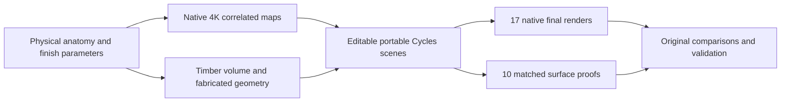
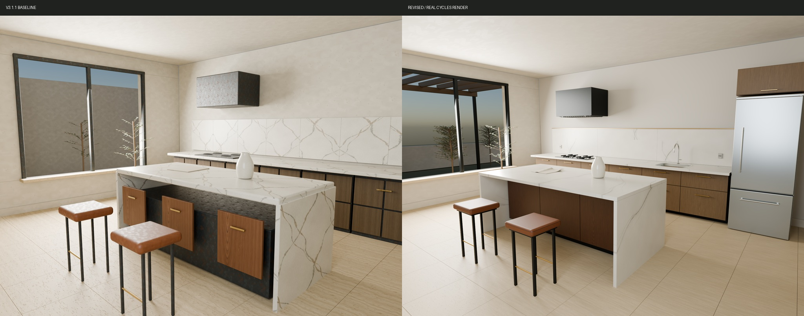
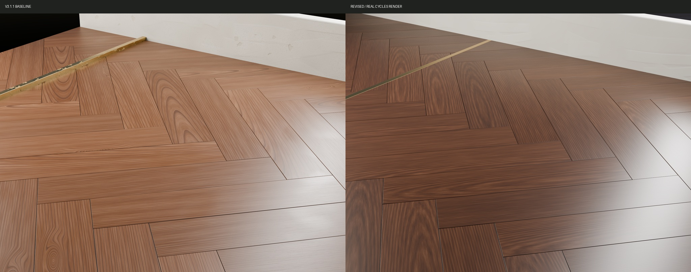
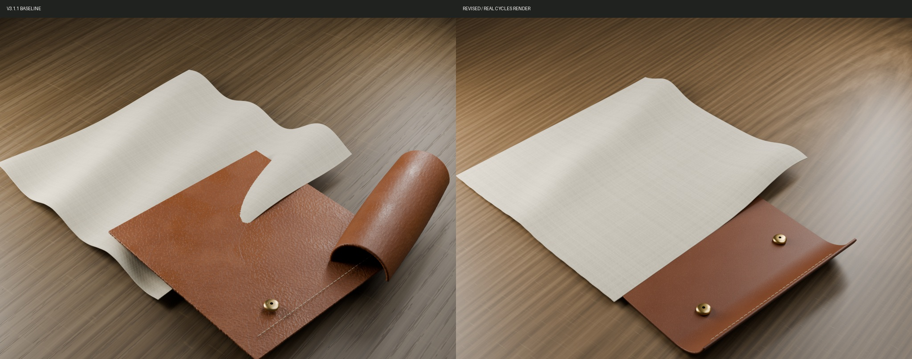
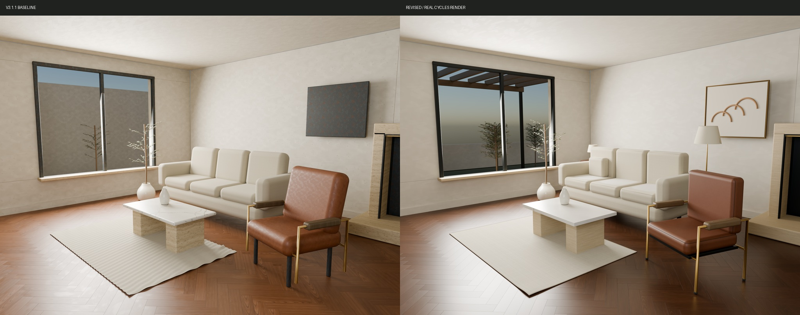
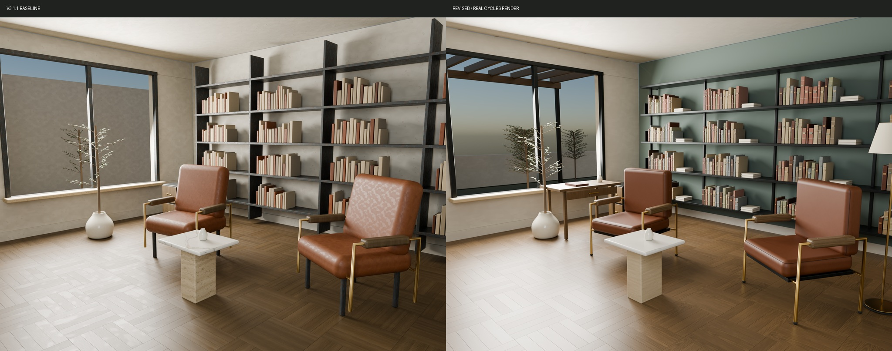

## Summary

Rebuild all seventeen material, still-life and architectural studies around
physical-scale anatomy and fabricated construction. The v3.1.1 views showed
contour-like walnut, oversized leather relief, widespread random metal damage,
a corrugated thin rug and island fronts floating on a black block. This branch
replaces those structures and renders the corrected meshes with real Cycles.

## What changed

- Ten native 4096² map sets and thirty exact Unity packed exports.
- Meter-space timber volume, individual cuts, coherent end grain and grain-driven finish.
- Honed geological stone, intact satin metals, clear shaped glaze, restrained hide grain and troweled plaster.
- Ten art-directed specimens plus the original ten matched surface-camera proofs.
- Three still lifes, three rooms and a parquet detail with sewn upholstery, constructed rug, bound books, fitted cabinetry, slab mapping and routed flush brass.
- Portable editable Blender scenes, native RGB16 PNGs, original evidence, comparisons and validation.

## Before and after

These are appearance comparisons: the material specimens deliberately have new
shapes. Original camera/light surface proofs are separately retained in
`path_traced/controlled_surfaces/`. Salon, library and still-life cameras are
retained. The kitchen main view widens to include the fitted refrigerator;
the original comparison camera remains editable in the scene.

The kitchen includes a formed sink, faucet, drain, refrigerator/freezer,
hinges, seals, vents, sockets and separate stainless, nickel and bronze finishes.
Salon and library have mineral painted walls, reading lamps and constructed
joinery. Leather seating includes compression, front-face curvature and sewn
welts following the rounded pads.

All seventeen pairs are in `docs/images/comparisons/`. All original native PNGs
are in `evidence/` with hashes and the baseline commit. Revised native PNGs are
in `path_traced/renders/`; render settings and timings are in the manifest.

## Validation

Local checks cover 120 native maps, 16-bit height, normal orientation, exact
packed channels, opacity, render dimensions/sample settings, relative texture
paths, book-to-shelf contact, upright termination, rug thickness/binding,
kitchen seating overhang, slab thickness, parquet coverage and non-overlapping
flush brass. The PR workflow repeats asset and native-scene validation.

All seventeen native final images and the representative proofs were visually
inspected. Surface/still-life/floor renders use 768 maximum / 128 minimum
samples without denoising; room renders use 512 / 128 with guided OIDN.
Rendering used local Blender 4.5.3 LTS and Cycles OptiX on an RTX 4060.

## Remaining limits

This is procedural approximation rather than measured scan fidelity. The 3D
Blender timber volume and exported finite wood maps are separate representations.
Cloth and upholstery are authored resting shapes, not cloth/pressure simulations.
Pores have no modeled undercuts; the garden and book title marks remain simple.
See `docs/STUDY_REPAIR_REVIEW.md` for the full critique and comparison caveats.

Keep this PR in draft for visual review. This branch does not merge, deploy or
publish a replacement release.
